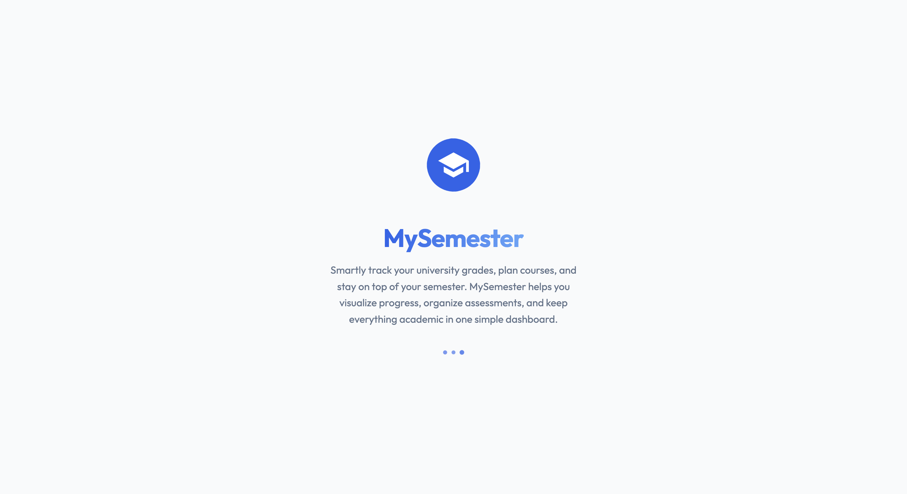
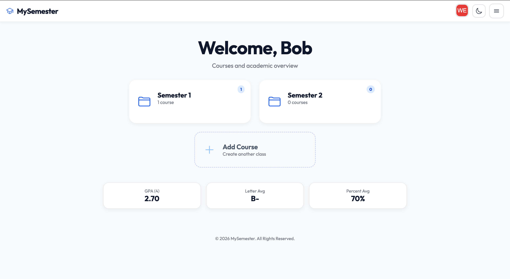
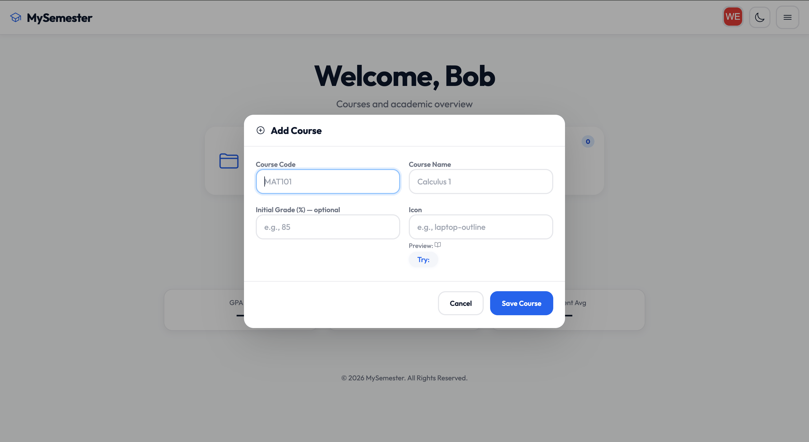
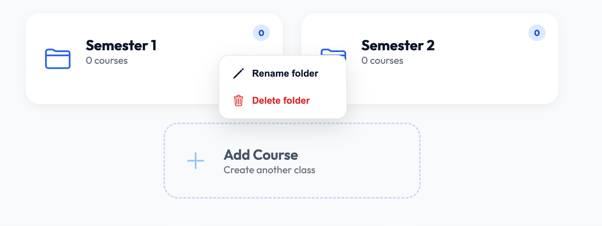
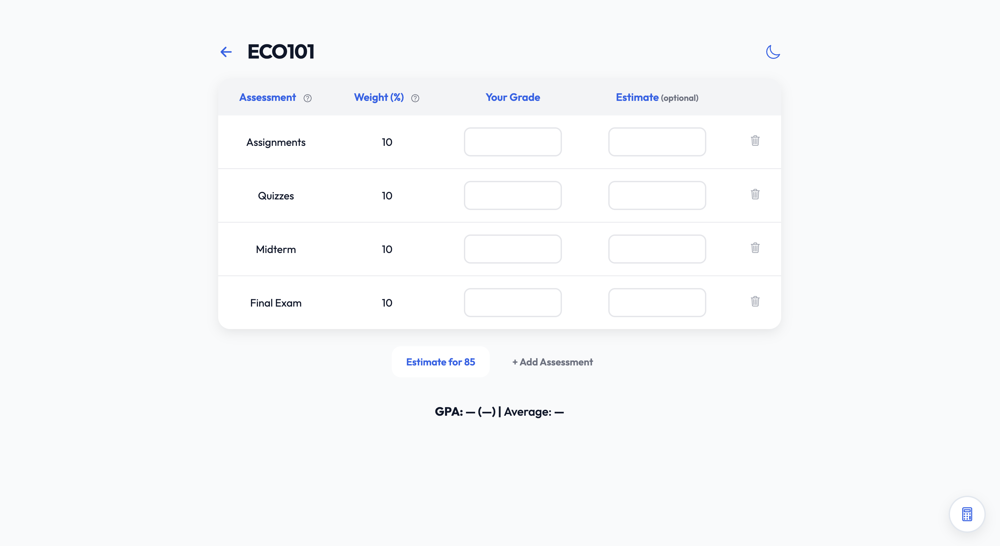
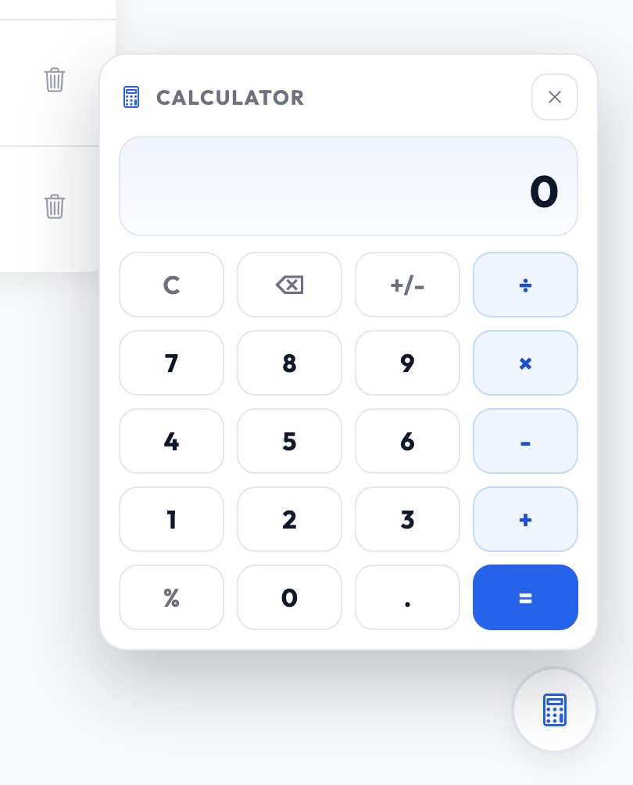
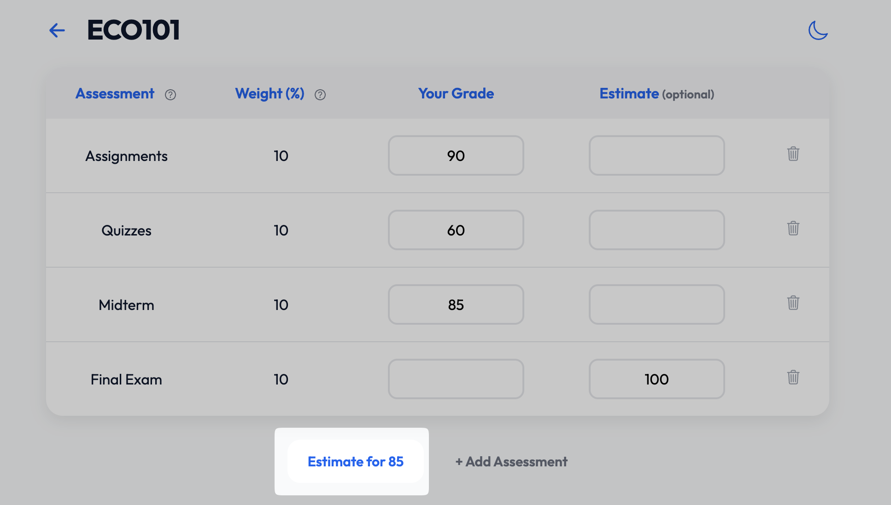
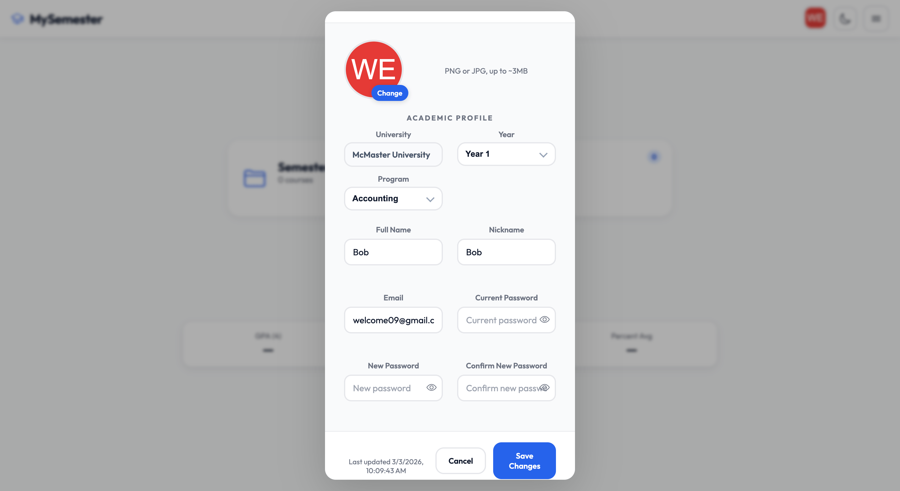

<p align="center">
  
</p>

<h1 align="center">MySemester</h1>

<p align="center">
  A clean student workspace for organizing courses, grades, assessments, folders, GPA scales, planning tools, and semester progress.
</p>

---

## Table of Contents
- [New Updates](#new-updates)
- [Overview](#overview)
- [Key Features](#key-features)
- [Feature Areas](#feature-areas)
- [How It Works](#how-it-works)
- [Tech Stack](#tech-stack)
- [Project Structure](#project-structure)
- [Local Development](#local-development)
- [Supabase Setup (Optional)](#supabase-setup-optional)
- [Data Export and Import](#data-export-and-import)
- [Deployment](#deployment)
- [License](#license)

## New Updates
Fresh improvements recently added to MySemester:

| Area | Update |
| --- | --- |
| Professor Picks | New UofT test page with course autocomplete, professor rating cards, RMP profile links where available, and dark mode support |
| AI Planner | Course Planner now uses autocomplete suggestions and removable selected-course chips |
| Course Explainer | Single-course autocomplete with selected course shown directly inside the search field |
| Dashboard | Folder detail counts now show child folders and course counts more clearly |
| Grades | Mobile grade saved notifications and no-assessment states were cleaned up |
| Profile | Users can change their university after setup |
| Mobile UX | Form inputs were adjusted to prevent unwanted zoom on phones |
| Navigation | GPA Scale and Professor Picks now share the same clean header style |
| About Modal | Updated content and cleaner feature overview, including experimental tools |

## Overview
MySemester is a lightweight web app for students who want fast, clear insight into course progress, GPA outcomes, and planning decisions without heavy setup.

It is intentionally browser-first:
- Manage courses, folders, assessments, and grades with minimal friction
- Instantly see GPA, average, and letter-grade impact
- Estimate target outcomes before finals and major assessments
- Use optional planning helpers for UofT Arts & Science workflows
- Keep data local by default, with optional Supabase sync when signed in



## Key Features
- Dashboard workspace: courses, folders, profile, settings, and semester details in one place
- Course folders: organize courses into parent folders and see nested folder/course counts
- Assessment tracking: manage grading items, weights, and performance per course
- Real-time GPA feedback: live GPA, average, and letter-grade calculations as inputs change
- Target estimates: set a goal grade and see what score is needed next
- Built-in calculator: quick calculations while entering grades
- University profile: choose or change your university and reference supported GPA scales
- AI Planner: unofficial UofT Arts & Science planning help with local fallback responses
- Course autocomplete: cleaner course selection in planner and explainer flows
- Professor Picks: experimental UofT professor comparison page with rating cards
- Theme support: light and dark modes across the main experience and newer tools
- Mobile polish: phone-friendly inputs, no unwanted typing zoom, and cleaner empty states
- Portability: export and import course + grade data
- Cloud sync: Supabase authentication and cross-device synchronization

## Feature Areas

### Dashboard
The dashboard is the main workspace for courses, folders, grades, files, account settings, theme controls, and profile details.

### Grades and Assessments
Each course can track weighted assessments, saved grades, target estimates, GPA output, and course averages. Grade entry includes a built-in calculator for faster updates.

### AI Planner
AI Planner includes:
- Course Planner with autocomplete course selection and selected-course chips
- Course Explainer with single-course autocomplete
- Course Catalog backed by `data/ai-planner-courses.json`
- Semester Check using saved MySemester course data where available
- Ask AI Planner marked as an upcoming/experimental flow

AI Planner is an unofficial helper. Important enrolment, POSt, graduation, GPA, and prerequisite decisions should always be verified with official university sources.

### Professor Picks
Professor Picks is an experimental UofT-only test page. It supports course-code autocomplete and displays clean professor comparison cards with star ratings, difficulty, would-take-again percentages, summaries, and direct RMP links when an individual profile URL is available.

### GPA Scale Guide
The GPA Scale page provides a cleaner reference point for university-specific grading scales and uses the same navigation style as newer standalone pages.

### Dashboard and Semester Overview


### Add Courses


### Manage Semester Folders


### Grade Entry and Assessment Tracking


### In-App Calculator


### Estimate Target Outcomes


### Profile and Account Settings


## How It Works
1. Create courses in the app dashboard.
2. Add weighted assessments and grades for each course.
3. Review calculated overall grades and GPA output instantly.
4. Use AI Planner, Course Explainer, GPA Scale, or Professor Picks when extra planning context helps.
5. Optionally sign in to sync your data with Supabase.
6. Export your data whenever you want a backup or migration file.

## Tech Stack
| Layer | Technology |
| --- | --- |
| Frontend | HTML, CSS, JavaScript |
| Local API | Node.js HTTP server for AI Planner routes |
| Auth + Storage | Supabase |
| Hosting | GitHub Pages (custom domain) |

## Project Structure
```text
/
├── index.html              # Landing page
├── index.css
├── index.js
├── login/
│   ├── index.html
│   ├── login.css
│   └── login.js
├── signup/
│   ├── index.html
│   ├── signup.css
│   └── signup.js
├── main/
│   ├── index.html
│   ├── main.css
│   ├── main.js
│   └── main.module.js
├── ai-planner/
│   ├── index.html
│   ├── ask/
│   ├── courses/
│   ├── explainer/
│   ├── ai-planner.css
│   └── ai-planner.js
├── data/
│   └── ai-planner-courses.json
├── gpa-scale/
│   ├── index.html
│   ├── gpa-scale.css
│   ├── gpa-scale.js
│   └── gpa-data.js
├── professors/
│   ├── index.html
│   ├── professors.css
│   └── professors.js
├── setup/
│   ├── index.html
│   ├── setup.css
│   └── setup.js
├── reset-password/
│   ├── index.html
│   ├── reset-password.css
│   └── reset-password.js
├── _private/
│   ├── server.js           # Optional local server with /api/ai-planner routes
│   └── supabase-init.js    # Supabase constants kept out of the public app root
└── grade/
    ├── index.html
    ├── grade.css
    └── grade.js
```

## Local Development
This project is a static website. Run a local server to avoid CORS and module import issues.

```bash
git clone https://github.com/<your-username>/MySemester.git
cd MySemester
python3 -m http.server 8080
```

Then open [http://localhost:8080](http://localhost:8080).

### AI Planner API (Optional)
The AI Planner page works as a static page with useful local mock responses if API routes are unavailable.

To run the server-side API routes locally:

```bash
node _private/server.js
```

Then open [http://localhost:3000/ai-planner/](http://localhost:3000/ai-planner/).

Set `OPENAI_API_KEY` to enable OpenAI-backed responses:

```bash
OPENAI_API_KEY=your_api_key_here node _private/server.js
```

If `OPENAI_API_KEY` is not set, these routes return deterministic mock responses:
- `/api/ai-planner/plan`
- `/api/ai-planner/ask`
- `/api/ai-planner/explain`
- `/api/ai-planner/semester-check`

AI Planner is an unofficial advising helper. Students should verify important decisions with the UofT Calendar, department pages, registrar, or an academic advisor.

## Supabase Setup (Optional)
If you want login + cloud sync, create a Supabase project and apply the SQL below.

### 1) Username to email lookup function
```sql
create or replace function public.get_email_by_username(u text)
returns text
language sql
security definer
as $$
  select email from public.profiles where username = u limit 1;
$$;

grant execute on function public.get_email_by_username(text) to anon;
```

### 2) Courses table and row-level security (RLS)
```sql
create table if not exists public.mysemester_courses (
  id uuid primary key default gen_random_uuid(),
  user_id uuid not null,
  course_id text not null,
  code text not null,
  title text,
  icon text,
  grade numeric,
  crncr boolean default false,
  weights jsonb,
  updated_at timestamptz default now()
);

create unique index if not exists mysemester_courses_user_course_id_idx
  on public.mysemester_courses (user_id, course_id);

alter table public.mysemester_courses enable row level security;

create policy "Users can read their courses"
on public.mysemester_courses
for select
using (auth.uid() = user_id);

create policy "Users can insert their courses"
on public.mysemester_courses
for insert
with check (auth.uid() = user_id);

create policy "Users can update their courses"
on public.mysemester_courses
for update
using (auth.uid() = user_id);

create policy "Users can delete their courses"
on public.mysemester_courses
for delete
using (auth.uid() = user_id);
```

## Data Export and Import
Export files include:
- Course metadata
- Grade breakdowns (`weights`)

To import:
1. Open the `/main/` app view.
2. Go to `Settings`.
3. Use the import option to restore data from your export file.

## Deployment
1. Push changes to GitHub.
2. Enable GitHub Pages for the repository.
3. Ensure folder-based routes are preserved:
   - `/login/`
   - `/signup/`
   - `/main/`
   - `/grade/`
   - `/gpa-scale/`
   - `/ai-planner/`
   - `/professors/`
4. Point your custom domain (optional), e.g. `mysemester.org`.

## Live Site
[https://mysemester.org](https://mysemester.org)

## License
All rights reserved.
